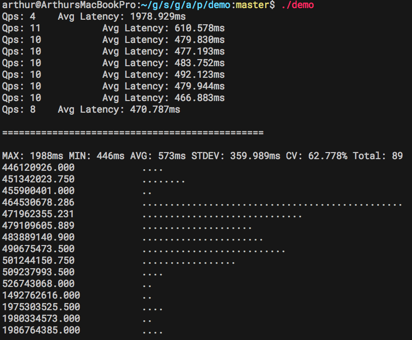

# perfm [](https://travis-ci.org/arthurkiller/perfm) [](https://goreportcard.com/report/github.com/arthurkiller/perfm)
a golang performence testing platform

## What's new
* v1.0 is comming out
* reconstruct the project for easy use
* remove the divided operation for bench and caculate

## Understand perfm Workflow

* a perfm job work like this...
```golang
for {
    job.Pre()

    start := time.Now()
    job.Do()
    count = time.Since(start)
}
job.After()
```


* perfm jobs work on different goroutine
        __job.Copy()__
+---------+ +---------+ +---------+
|   job   | |   job   | |   job   |
|         | |         | |         |
|for{     | |for{     | |for{     |
| pre()   | | pre()   | | pre()   |
| do()    | | do()    | | do()    | ... ...
|}        | |}        | |}        |
| after() | | after() | | after() |
+---------+ +---------+ +---------+

## Short Example
You can start with `Wizard.sh` creating your job templates.

```go
type job struct {
	// job private data
	url string
}

// Copy will called in parallel
func (j *job) Copy() (perfm.Job,error) {
	jc := *j
	return &jc, nil
}

func (j *job) Pre() error {
	// do pre job, prepare the data
    return nil
}
func (j *job) Do() error {
	// do benchmark job, the cost will be count
	_, err := http.Get(j.url)
	return err
}
func (j *job) After() {
	// do clean job, only called in the end of the job
}

// start perfm
perfm := perfm.New(perfm.WithBinsNumber(15), perfm.WithParallel(5), perfm.WithDuration(10))
j := &job{}
j.url = "http://www.baidu.com"
perfm.Regist(j)

perfm.Start()
perfm.Wait()
```



## Milestone
* version 0.1 
    support the qps and average cost counting
* version 1.0
    change the perfm into a testing interface, just rejuest and start, the test will be automaticly done
* version 2.0
    add the excel/numbers .cvs file export. make it easy to draw graphic with other data processor.
